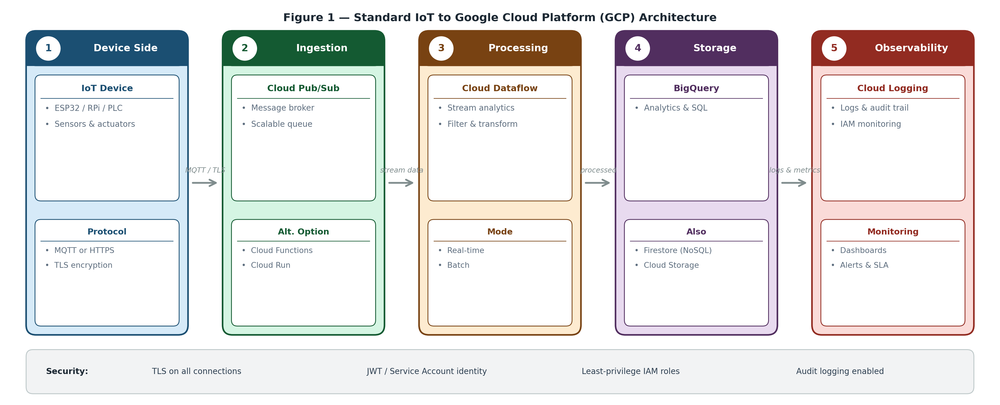

# Secure IoT Telemetry Pipeline on GCP

A production-style Proof of Concept (PoC) demonstrating a secure IoT data pipeline using:

* Google Cloud Pub/Sub
* BigQuery (Direct Subscription)
* IAM & Service Accounts
* Monitoring via Cloud Monitoring

This project simulates an IoT device publishing telemetry data securely to Google Cloud.

---
# Architecture Overview



---

# Architecture of PoC

IoT Device (Simulator)
→ Pub/Sub Topic
→ BigQuery Subscription
→ Monitoring Dashboard

---

# 1. GCP Setup

## 1.1 Create Project

* Create a new project in Google Cloud Console
* Enable billing
* Enable APIs:

  * Cloud Pub/Sub API
  * BigQuery API
  * Cloud Monitoring API

---

## 1.2 Create Pub/Sub Topic & Subscription

```bash
gcloud pubsub topics create temperature-readings
gcloud pubsub subscriptions create temperature-sub \
  --topic=temperature-readings
```

---

## 1.3 Create Service Account

```bash
gcloud iam service-accounts create device-publisher
```

Grant publisher role:

```bash
gcloud projects add-iam-policy-binding YOUR_PROJECT_ID \
  --member="serviceAccount:device-publisher@YOUR_PROJECT_ID.iam.gserviceaccount.com" \
  --role="roles/pubsub.publisher"
```

---

## 1.4 Create and Download Key

```bash
gcloud iam service-accounts keys create key.json \
  --iam-account=device-publisher@YOUR_PROJECT_ID.iam.gserviceaccount.com
```

---

# 2. IoT Device Simulation

Install dependency:

```bash
pip install google-cloud-pubsub
```

Create file:

`iot_simulator.py`

```python
import time
import json
import random
from google.cloud import pubsub_v1
from google.oauth2 import service_account

project_id = "YOUR_PROJECT_ID"
topic_id = "temperature-readings"
credentials_path = "key.json"

credentials = service_account.Credentials.from_service_account_file(
    credentials_path
)

publisher = pubsub_v1.PublisherClient(credentials=credentials)
topic_path = publisher.topic_path(project_id, topic_id)

print("Simulated IoT device started...")

while True:
    temperature = round(random.uniform(20.0, 35.0), 2)

    payload = {
        "device_id": "sim-device-001",
        "temperature": temperature,
        "timestamp": time.time()
    }

    data = json.dumps(payload).encode("utf-8")
    publisher.publish(topic_path, data)

    print(f"Published: {payload}")
    time.sleep(5)
```

---

# 3. Verify Messages

```bash
gcloud pubsub subscriptions pull temperature-sub --limit=5 --auto-ack
```

---

# 4. Routing Data to BigQuery (Recommended)

## Step 1 – Create Dataset

```bash
bq mk --dataset YOUR_PROJECT_ID:iot_dataset
```

---

## Step 2 – Create Table

```bash
bq mk --table \
iot_dataset.temperature_data \
device_id:STRING,temperature:FLOAT,timestamp:FLOAT
```

---

## Step 3 – Grant Pub/Sub Permission

Replace PROJECT_NUMBER:

```bash
gcloud projects add-iam-policy-binding YOUR_PROJECT_ID \
  --member="serviceAccount:service-PROJECT_NUMBER@gcp-sa-pubsub.iam.gserviceaccount.com" \
  --role="roles/bigquery.dataEditor"
```

---

## Step 4 – Create BigQuery Subscription

```bash
gcloud pubsub subscriptions create bq-temperature-sub \
  --topic=temperature-readings \
  --bigquery-table=YOUR_PROJECT_ID:iot_dataset.temperature_data \
  --use-table-schema
```

---

## Step 5 – Test Query

```bash
bq query --use_legacy_sql=false \
'SELECT * FROM `YOUR_PROJECT_ID.iot_dataset.temperature_data`
 ORDER BY timestamp DESC LIMIT 5'
```

If rows appear → pipeline works.

---

# Monitoring

Go to:

Cloud Monitoring → Dashboards → Predefined → Pub/Sub

### Key Metrics

| Metric                                  | Meaning            |
| --------------------------------------- | ------------------ |
| subscription/num_undelivered_messages   | Detect backlog     |
| subscription/oldest_unacked_message_age | Detect delays      |
| topic/send_message_operation_count      | Publishing rate    |
| bigquery/streaming/insert_errors_count  | Streaming failures |

---

# What This PoC Demonstrates

* Secure IoT authentication using IAM
* Scalable ingestion via Pub/Sub
* Direct streaming to BigQuery
* Production-style monitoring
